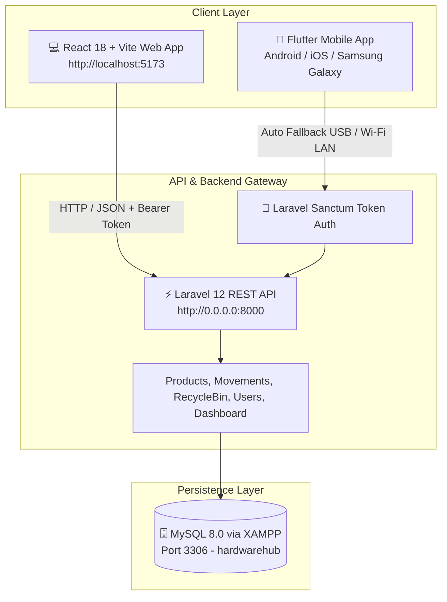

# 🛠️ HardwareHub — Full-Stack Product Management Suite

[](./HardwareHub_Project_Submission_Report.pdf)
[](https://laravel.com)
[](https://react.dev)
[](https://flutter.dev)
[](https://mysql.com)

> **Intern Full-Stack Development Task Assessment Submission**  
> Comprehensive multi-platform inventory solution featuring a **Laravel 12 REST API Gateway**, **React 18 Web Portal**, and a **Flutter Mobile App** with resilient multi-network auto-fallback connectivity.

---

## 📑 Assessment Documentation & Reports

* 📄 **[📥 View / Download Official Submission Report (PDF)](./HardwareHub_Project_Submission_Report.pdf)** — Publication-ready 2-page assessment summary with compliance tables and architecture.
* 📖 **[📖 Full Technical Report (Markdown)](./PROJECT_SUBMISSION_REPORT.md)** — Complete database schemas, all API endpoints, and implementation details.

---

## 🏗️ System Architecture



---

## ✅ PDF Assessment Compliance Checklist

| Feature | Assessment Specification | Implementation | Status |
|---|---|---|:---:|
| **Authentication** | Login & Logout (Web + Mobile) | Laravel Sanctum Token & Session Auth with validation | ✅ **Done** |
| **Dashboard** | Authenticated KPIs Summary | Real-time Products, Stock Units, Valuation, Low Stock Alerts | ✅ **Done** |
| **Users View** | Registered Users List | User listing with role badges & timestamps | ✅ **Done** |
| **Product CRUD** | Create, View, Edit, Delete | Full CRUD with unique SKU validation, categories, price, min stock | ✅ **Done** |
| **Recycle Bin** | Soft Delete, Restore, Purge | Laravel `SoftDeletes` trait, 1-click restore & permanent deletion | ✅ **Done** |
| **REST APIs** | Standardized JSON Endpoints | Protected Sanctum API routes for mobile & web clients | ✅ **Done** |
| **Flutter App** | Mobile UI & CRUD Screens | Clean Slate/Indigo UI, inline subheader pills, and zero-hang network engine | ✅ **Done** |
| **Bonus Features** | Stock Ledger & Reports | IN/OUT/ADJUST/DAMAGE audit trails, CSV & PDF export generation | ⭐ **Bonus** |

---

## 🚀 Step-by-Step Setup & How to Run

### 1. Database Setup (MySQL / XAMPP)
1. Open **XAMPP Control Panel** and click **Start** on **MySQL** (Port 3306).
2. Create database: `hardwarehub`
3. Run migrations and seed data:
   ```bash
   cd hardwarehub-backend
   php artisan migrate:fresh --seed
   ```

### 2. Start Laravel Backend Server
```bash
cd hardwarehub-backend
php artisan serve --host 0.0.0.0 --port 8000
```

### 3. Start React Web Frontend
```bash
cd hardwarehub-backend
npm run dev
```
👉 Open browser at: **`http://localhost:5173`**

### 4. Run Flutter Mobile App
```bash
cd hardwarehub_mobile
flutter run
```
*Note: The app features an intelligent **Multi-URL Auto-Fallback Engine** that automatically detects both USB (`127.0.0.1:8000`) and Wi-Fi LAN (`192.168.1.3:8000`) without manual setup.*

---

## 🔑 Default Administrator Credentials

| Field | Credential |
|---|---|
| **Email** | `admin@hardwarehub.com` |
| **Password** | `password` |

---

## 📂 Repository Structure

```
HardwareHub/
├── HardwareHub_Project_Submission_Report.pdf  # 📄 Official 2-Page PDF Assessment Report
├── PROJECT_SUBMISSION_REPORT.md              # 📖 Full Technical Markdown Report
├── project_report.html                       # 🌐 HTML source for PDF report
├── README.md                                 # 📌 GitHub Repository Guide
├── hardwarehub-backend/                      # ⚡ Laravel 12 Backend & React Frontend
└── hardwarehub_mobile/                       # 📱 Flutter Mobile Application
```
